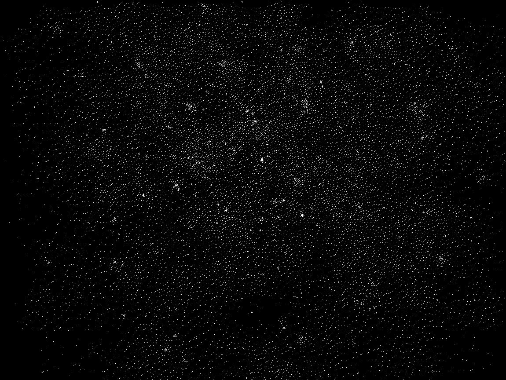

O código em Haxe serve somente para aplicar um filtro de
dithering segundo o algoritmo Floyd-Stanberg para imagens
de um canal só (o programa converte para tons de cinza),
ou seja, é um efeito puramente estético e não afeta o
resto do projeto.

A escolha da linguagem foi devido somente à preferência.

Alguns exemplos de uso a seguir:

Original | Com efeito
:-------:|:--------:
 | 
 | 
 | 
 | 

Como pode-se notar, os resultados ficam melhores quando a imagem
original é escura e tem silhuetas fortes (a má aplicação é
especialmente visivel no ultimo exemplo).

Finalmente, para rodar esse codigo basta ir para a pasta que contém
o [código fonte](src/) e rodar o comando `make images` para gerar as
imagens, sabendo que as originais devem ficar na pasta `assets/original`
e finais ficarão na pasta `assets/final`.

*obs*: É necessário ter instalado a biblioteca
[format](https://github.com/HaxeFoundation/format), o que pode ser feito
com `haxelib install format` depois de instalar a linguagem Haxe.

*obs2*: O código usa o backend Neko mas à princípio qualquer backend
com suporte à escrita de arquivos deveria funcionar.
