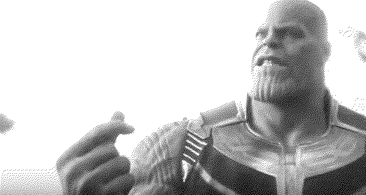

O código em Haxe serve somente para aplicar um filtro de
dithering segundo o algoritmo Floyd-Stanberg para imagens
de um canal só, ou seja, é um efeito puramente estético e
não afeta o resto do projeto.

A escolha da linguagem foi devido somente à preferência.

Alguns exemplos de uso a seguir:

Original | Com efeito
:-------:|:--------:
 | 
 | 
 | 
 | 

Como pode-se notar, os resultados ficam melhores quando a imagem
original é escura e tem silhuetas fortes (a má aplicação é
especialmente visivel no ultimo exemplo).

Finalmente, para rodar esse codigo basta ir para a pasta`src` e
rodar o comando `make run` para criar as imagens, sabendo que as
originais devem ficar na pasta `assets/original` e finais ficarão
na pasta `assets/final`.
